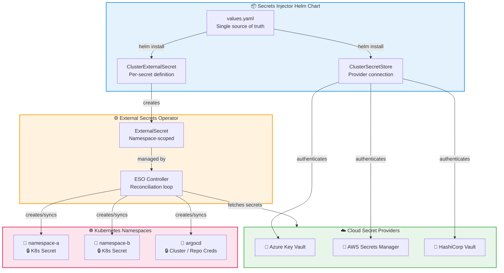

<div align="center">

# 🔐 Secrets Injector

**Declaratively manage external secrets across your entire Kubernetes cluster with a single Helm chart.**

[](https://github.com/marcus1aleksand/secrets-injector/releases)
[](LICENSE)
[](https://kubernetes.io)
[](https://external-secrets.io)

[](https://github.com/marcus1aleksand/secrets-injector/actions/workflows/linting_scanning.yml)
[](https://github.com/marcus1aleksand/secrets-injector/actions/workflows/update_semantic_version-dynamic.yml)

---

*An add-on Helm chart for the [External Secrets Operator](https://external-secrets.io/) that lets you define ClusterSecretStores, ClusterExternalSecrets, and every secret type you need — ArgoCD clusters, repo credentials, TLS certificates, multivalue secrets, and more — all from a single `values.yaml`.*

[📖 Documentation](https://marcus1aleksand.github.io/secrets-injector/) · [🚀 Getting Started](#-quick-start) · [💡 Examples](#-secret-type-examples)

</div>

## 🏗️ Architecture

The Secrets Injector sits on top of the External Secrets Operator, providing a declarative abstraction layer that simplifies secret management at scale.



## ✨ Key Features

| Feature | Description |
|---------|-------------|
| 🌐 **Multi-Cloud** | Azure Key Vault, AWS Secrets Manager, HashiCorp Vault |
| 📦 **Single Chart** | Define all secrets across all namespaces in one `values.yaml` |
| 🔄 **Auto-Sync** | Secrets refresh automatically (configurable interval) |
| 🏷️ **ArgoCD Integration** | Native support for cluster secrets and repo credentials |
| 🔒 **TLS Secrets** | First-class `kubernetes.io/tls` secret support |
| 📊 **Multivalue** | Extract all keys from a single cloud secret automatically |
| 🏗️ **Cluster-Wide** | ClusterExternalSecrets deploy to any namespace via selectors |
| 🛡️ **Security Scanned** | Checkov IaC scanning on every PR |
| 📋 **Custom Labels** | Attach labels to generated secrets (Grafana contact points, etc.) |

## 🚀 Quick Start

### Prerequisites

- Kubernetes cluster (v1.28+)
- [External Secrets Operator](https://external-secrets.io/) installed
- Access to a supported secret provider (Azure KV, AWS SM, or Vault)

### Installation

```bash
# Install from GHCR OCI registry
helm install secrets-injector \
  oci://ghcr.io/marcus1aleksand/helm-charts/secrets-injector \
  -f values.yaml
```

### Minimal Configuration

```yaml
# values.yaml
clustersecretstore:
  name: my-azure-backend
  providerType: azurekv
  azurekv:
    tenantid: "your-tenant-id"
    vaulturl: "https://my-vault.vault.azure.net"
    identityid: "your-managed-identity-client-id"

externalsecrets:
  - secret: my-app-secret
    multivalue: true
    clustersecstore: my-azure-backend
    namespace: my-app
    namespacesecretname: app-credentials
    keyvaultsecretname: my-app-credentials
```

## 🔑 Cloud Provider Setup

<details>
<summary><strong>Azure Key Vault (Managed Identity)</strong></summary>

```yaml
clustersecretstore:
  name: cluster-azure-backend
  providerType: azurekv
  azurekv:
    tenantid: "00000000-0000-0000-0000-000000000000"
    vaulturl: "https://my-keyvault.vault.azure.net"
    identityid: "00000000-0000-0000-0000-000000000000"
```

</details>

<details>
<summary><strong>Azure Key Vault (Service Principal)</strong></summary>

```yaml
clustersecretstore:
  name: cluster-azure-backend
  providerType: azurekv
  azurekv:
    tenantid: "00000000-0000-0000-0000-000000000000"
    vaulturl: "https://my-keyvault.vault.azure.net"
    clientid:
      name: azure-secret-sp
      namespace: eso
      id: ClientID
    clientsecret:
      name: azure-secret-sp
      namespace: eso
      id: ClientSecret
```

</details>

<details>
<summary><strong>AWS Secrets Manager (IRSA)</strong></summary>

```yaml
clustersecretstore:
  name: cluster-aws-backend
  providerType: aws
  aws:
    region: "us-east-1"
    auth:
      serviceAccountName: "external-secrets-sa"
      serviceAccountNamespace: "external-secrets"
```

</details>

<details>
<summary><strong>HashiCorp Vault</strong></summary>

```yaml
clustersecretstore:
  name: hcp-vault-backend
  providerType: vault
  vault:
    server: "https://vault.example.com"
    path: "secret"
    version: "v2"
    auth:
      tokenName: "vault-token"
      tokenNamespace: "external-secrets"
      tokenKey: "vault-token"
```

</details>

## 💡 Secret Type Examples

### Multivalue Secret (extract all keys)

```yaml
externalsecrets:
  - secret: app-config
    multivalue: true
    clustersecstore: cluster-azure-backend
    namespace: my-app
    namespacesecretname: app-config
    keyvaultsecretname: my-app-config
```

### Single Value Secret

```yaml
externalsecrets:
  - secret: db-password
    clustersecstore: cluster-azure-backend
    namespace: my-app
    namespacesecretname: db-credentials
    namespacesecretkeyname: password
    keyvaultsecretname: database-password
```

### Single Property from JSON Secret

```yaml
externalsecrets:
  - secret: api-key
    clustersecstore: cluster-azure-backend
    namespace: my-app
    namespacesecretname: api-credentials
    namespacesecretkeyname: key
    keyvaultsecretname: api-config
    property: apiKey
```

### TLS Certificate

```yaml
externalsecrets:
  - secret: wildcard-tls
    type: "kubernetes.io/tls"
    clustersecstore: cluster-azure-backend
    namespace: ingress-nginx
    namespacesecretname: wildcard-cert
    namespacesecretkeynamecrt: tls.crt
    namespacesecretkeynamekey: tls.key
    keyvaultsecretname: wildcard-cert
```

### ArgoCD Cluster Secret (Certificate Auth)

```yaml
externalsecrets:
  - secret: prod-cluster
    argocd: true
    clustersecstore: cluster-azure-backend
    namespace: argocd
    namespacesecretname: prod-cluster-secret
    keyvaultsecretname: argocd-prod-cluster
```

### ArgoCD Cluster Secret (Bearer Token Auth)

```yaml
externalsecrets:
  - secret: staging-cluster
    argocd: true
    argocdBearerToken: true
    clustersecstore: cluster-azure-backend
    namespace: argocd
    namespacesecretname: staging-cluster-secret
    keyvaultsecretname: argocd-staging-cluster
```

### ArgoCD Repository Credentials

```yaml
externalsecrets:
  - secret: github-repo-creds
    argocdRepoCreds: true
    clustersecstore: cluster-azure-backend
    namespace: argocd
    namespacesecretname: github-repo-creds
    keyvaultsecretname: argocd-github-credentials
```

### Grafana Contact Point

```yaml
externalsecrets:
  - secret: grafana-contact-points
    contactpoint: true
    clustersecstore: cluster-azure-backend
    namespace: monitoring
    namespacesecretname: grafana-contact-points
    keyvaultsecretname: grafana-contactpoints-yaml
```

### Secret with Custom Labels

```yaml
externalsecrets:
  - secret: labeled-secret
    multivalue: true
    clustersecstore: cluster-azure-backend
    namespace: my-app
    namespacesecretname: my-labeled-secret
    keyvaultsecretname: my-secret
    labels:
      app: my-app
      environment: production
```

### Non-Opaque Secret with Custom Type

```yaml
externalsecrets:
  - secret: docker-registry
    type: "kubernetes.io/dockerconfigjson"
    clustersecstore: cluster-azure-backend
    namespace: my-app
    namespacesecretname: registry-creds
    namespacesecretkeyname: .dockerconfigjson
    keyvaultsecretname: docker-registry-config
```

## 📋 Values Reference

| Parameter | Type | Default | Description |
|-----------|------|---------|-------------|
| `clustersecretstore.name` | string | `cluster-azure-backend` | Name of the ClusterSecretStore resource |
| `clustersecretstore.providerType` | string | `azurekv` | Provider type: `azurekv`, `aws`, or `vault` |
| `clustersecretstore.azurekv.tenantid` | string | — | Azure AD Tenant ID |
| `clustersecretstore.azurekv.vaulturl` | string | — | Azure Key Vault URL |
| `clustersecretstore.azurekv.identityid` | string | — | Managed Identity Client ID |
| `clustersecretstore.aws.region` | string | `us-east-1` | AWS region |
| `clustersecretstore.aws.auth.serviceAccountName` | string | — | K8s SA with IRSA annotation |
| `clustersecretstore.vault.server` | string | — | Vault server URL |
| `clustersecretstore.vault.path` | string | — | Vault secrets engine path |
| `clustersecretstore.vault.version` | string | `v2` | KV engine version |
| `externalsecrets[].secret` | string | — | ClusterExternalSecret resource name |
| `externalsecrets[].clustersecstore` | string | — | Target ClusterSecretStore name |
| `externalsecrets[].namespace` | string | — | Target namespace for the secret |
| `externalsecrets[].namespacesecretname` | string | — | Name of the K8s Secret created |
| `externalsecrets[].keyvaultsecretname` | string | — | Remote secret key name |
| `externalsecrets[].multivalue` | bool | `false` | Extract all keys from remote secret |
| `externalsecrets[].argocd` | bool | `false` | Create as ArgoCD cluster secret |
| `externalsecrets[].argocdBearerToken` | bool | `false` | Use bearer token auth for ArgoCD |
| `externalsecrets[].argocdRepoCreds` | bool | `false` | Create as ArgoCD repo credentials |
| `externalsecrets[].type` | string | — | K8s secret type (e.g., `kubernetes.io/tls`) |
| `externalsecrets[].contactpoint` | bool | `false` | Create as Grafana contact point |
| `externalsecrets[].labels` | map | — | Custom labels for the generated secret |
| `externalsecrets[].property` | string | — | Extract specific JSON property |
| `externalsecrets[].namespaceSelector` | object | — | Custom namespace selector (overrides `namespace`) |

## 🛡️ Security

- **Checkov scanning** runs on every PR for IaC security and compliance
- **Pre-commit hooks** for local validation before push
- **Helm lint** validates chart structure on every PR

## 📚 Documentation

Full documentation is available at **[marcus1aleksand.github.io/secrets-injector](https://marcus1aleksand.github.io/secrets-injector/)**

## 👤 Maintainers

| Name | Email |
|------|-------|
| Marcus Aleksandravicius | marcus1aleksand@gmail.com |

## 📄 License

This project is licensed under the MIT License — see the [LICENSE](LICENSE) file for details.
