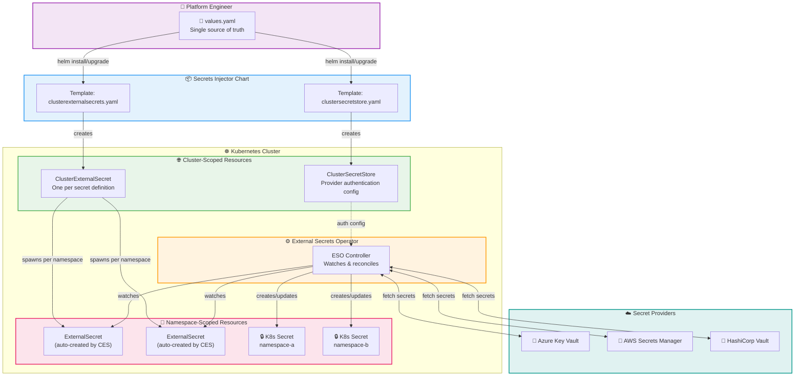
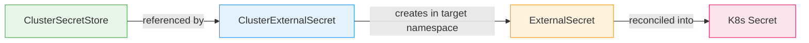
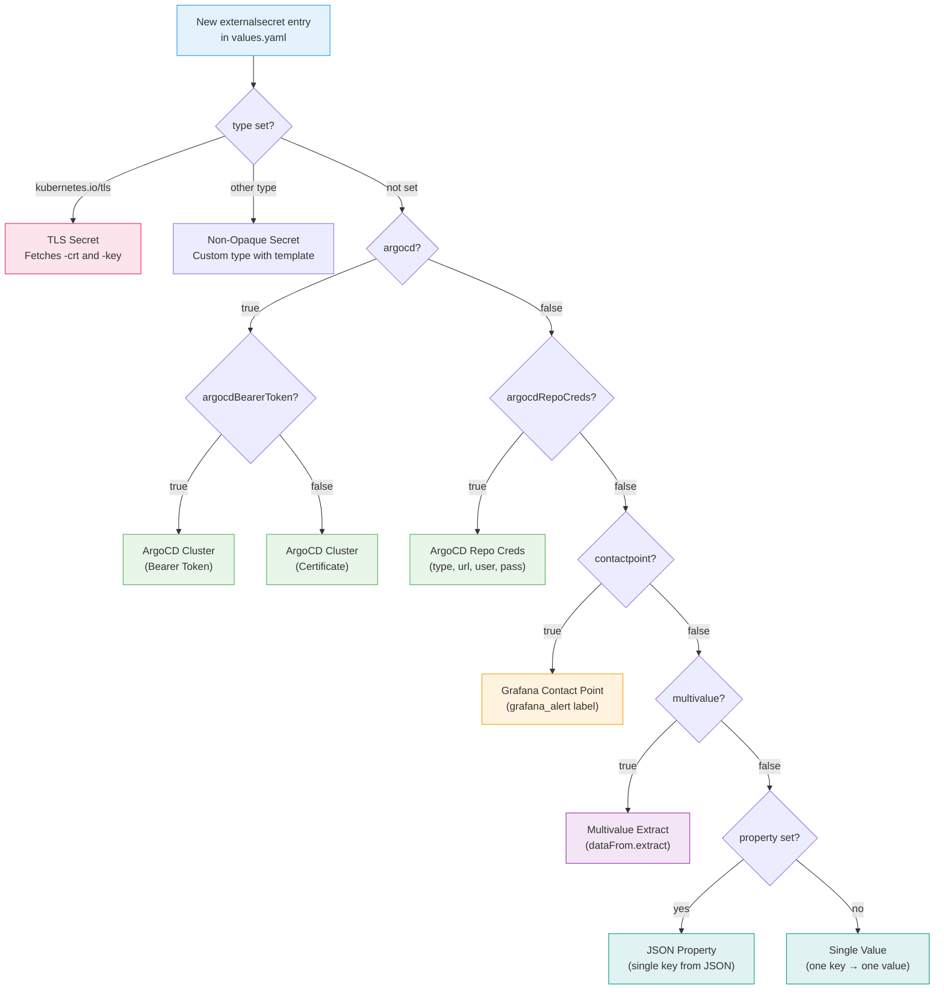
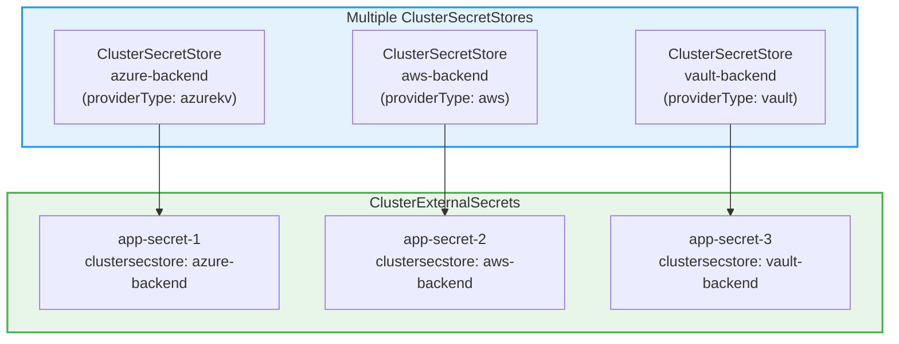

# 🏗️ Architecture

## Overview

The Secrets Injector is a Helm chart that generates [External Secrets Operator](https://external-secrets.io/) custom resources. It doesn't run any pods itself — it's purely a declarative layer that templates `ClusterSecretStore` and `ClusterExternalSecret` resources from your `values.yaml`.

## Full Resource Flow

## Resource Hierarchy

| Resource | Scope | Created By | Purpose |
|----------|-------|------------|---------|
| `ClusterSecretStore` | Cluster | Helm chart | Defines how to connect to the cloud provider |
| `ClusterExternalSecret` | Cluster | Helm chart | Defines which secret to fetch and where to put it |
| `ExternalSecret` | Namespace | ESO (from CES) | Namespace-scoped copy, drives reconciliation |
| `Secret` | Namespace | ESO Controller | The actual Kubernetes Secret with synced data |

## Secret Type Decision Flow

## Multi-Cloud Support

The `ClusterSecretStore` template supports three providers. Only one is active per store, but you can create multiple stores for multi-cloud setups.

!!! info "Multiple Helm Releases"
    To use multiple cloud providers, install the chart multiple times with different release names and `values.yaml` files — one per provider.

## Sync Lifecycle

1. **Helm Install/Upgrade** — Chart templates render `ClusterSecretStore` + `ClusterExternalSecret` resources
2. **CES → ES** — ESO creates a namespace-scoped `ExternalSecret` in each matched namespace
3. **ES → Provider** — ESO controller authenticates via `ClusterSecretStore` and fetches the remote secret
4. **ES → Secret** — ESO creates/updates the Kubernetes `Secret` with the fetched data
5. **Refresh** — Every 5 minutes (configurable), ESO re-fetches and updates the secret
6. **Helm Uninstall** — All resources are cleaned up (secrets have `creationPolicy: Owner`)
