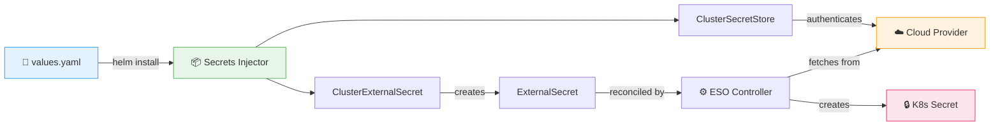

# 🔐 Secrets Injector

**Declaratively manage external secrets across your entire Kubernetes cluster with a single Helm chart.**

---

## What is Secrets Injector?

Secrets Injector is an add-on Helm chart for the [External Secrets Operator](https://external-secrets.io/) that simplifies the creation and management of external secrets resources in Kubernetes. Instead of writing individual YAML manifests for each `ClusterSecretStore`, `ClusterExternalSecret`, and `ExternalSecret`, you define everything in a single `values.yaml`.

!!! tip "One Chart, All Secrets"
    Define ArgoCD cluster credentials, TLS certificates, multivalue secrets, Grafana contact points, and more — all from a single Helm release.

## Key Features

| Feature | Description |
|---------|-------------|
| 🌐 **Multi-Cloud** | Azure Key Vault, AWS Secrets Manager, HashiCorp Vault |
| 📦 **Single Chart** | Define all secrets across all namespaces in one `values.yaml` |
| 🔄 **Auto-Sync** | Secrets refresh automatically every 5 minutes |
| 🏷️ **ArgoCD Integration** | Native support for cluster secrets and repo credentials |
| 🔒 **TLS Secrets** | First-class `kubernetes.io/tls` secret support |
| 📊 **Multivalue** | Extract all keys from a single cloud secret |
| 🛡️ **Security Scanned** | Checkov IaC scanning on every PR |

## How It Works



## Quick Install

```bash
helm install secrets-injector \
  oci://ghcr.io/marcus1aleksand/helm-charts/secrets-injector \
  -f values.yaml
```

## Next Steps

- [Getting Started](getting-started.md) — Set up your first secret in 5 minutes
- [Architecture](architecture.md) — Understand the full resource flow
- [Secret Types](secret-types/index.md) — Explore all supported secret patterns
- [Cloud Providers](providers/azure.md) — Configure your secret backend
